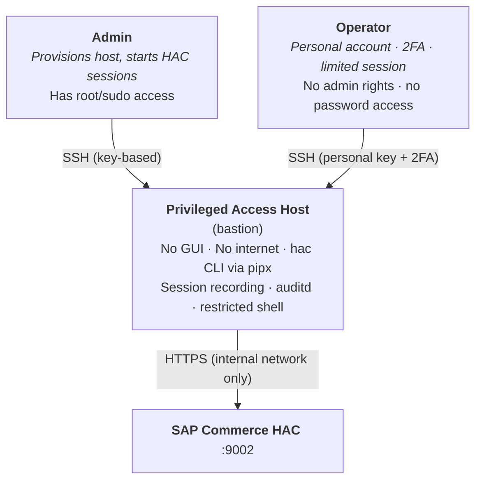

# Privileged Access Host

The HAC CLI enables a **Privileged Access Host** pattern — a hardened bastion for SAP Commerce administration that eliminates the need for browser-based HAC access entirely.

Two distinct roles interact with the host: an **admin** who provisions and authenticates, and **operators** who run day-to-day commands within a pre-authenticated, fully logged session.

---

## The problem with web-based HAC

The SAP Commerce HAC web console is powerful — and risky:

| Risk | Impact |
|------|--------|
| **Browser on workstations** | Full GUI stack = larger attack surface |
| **Internet-connected machines** | Exposed to phishing, drive-by downloads, browser exploits |
| **No session logging** | What was executed? By whom? No audit trail beyond server logs |
| **Credential exposure** | Password typed into a browser form on a potentially compromised machine |
| **Copy-paste mistakes** | Groovy scripts, Impex — a wrong paste in a browser can be catastrophic |
| **Shared accounts** | Multiple people using the same HAC login, no individual accountability |

---

## Architecture



---

## Role separation

### Admin

- Has `sudo` / root access on the bastion
- Installs and configures the CLI, environments, endpoints
- Starts HAC sessions — the **only** person who handles passwords
- Password is provided via **stdin only** (not stored in env vars, not in shell history, not visible in `/proc`)
- May rotate sessions on a schedule

### Operator

- Personal, named account (no shared logins)
- Authenticated via SSH key + 2FA (TOTP, hardware key, etc.)
- **No admin rights** on the machine
- **Cannot read passwords** — the HAC session is pre-authenticated by admin; operator only uses cached tokens
- **Cannot access the session cache of other users** (file permissions)
- Time-limited SSH sessions (e.g. `MaxSessions`, `ClientAliveInterval`)
- Every keystroke recorded via terminal session logging

---

## Security benefits

| Aspect | Web HAC | CLI on Privileged Host |
|--------|---------|----------------------|
| **Attack surface** | Full browser + GUI stack | Minimal: SSH + CLI binary, no GUI |
| **Internet exposure** | Often internet-connected | Air-gapped or tightly restricted |
| **Session logging** | Limited server-side logs | Full terminal recording (`script`, `auditd`) |
| **Credential handling** | Browser form, clipboard | stdin only — not in env, history, or procfs |
| **Identity** | Shared HAC accounts | Personal OS accounts with 2FA |
| **Least privilege** | All-or-nothing HAC access | Admin provisions, operator executes |
| **Reproducibility** | Manual clicks | Scripts in version control |
| **Blast radius** | Browser compromise = full access | No GUI, no browser, no clipboard exposure |

---

## Setup (admin)

### 1. Provision the bastion host

```bash
# Hardened Linux server — no GUI packages
sudo apt install --no-install-recommends python3 pipx openssh-server auditd

# Lock down network: only allow SSH in, only HAC endpoints out
sudo ufw default deny incoming
sudo ufw default deny outgoing
sudo ufw allow in ssh
sudo ufw allow out to 10.0.0.0/8 port 9002 proto tcp  # HAC endpoints
sudo ufw enable
```

### 2. Install the CLI

```bash
pipx install hac-client-cli
```

### 3. Configure environments

```bash
hac env add production
hac endpoint add production node1 --url https://10.0.1.10:9002 --set-default
hac endpoint add production node2 --url https://10.0.1.11:9002
```

### 4. Create operator accounts

```bash
# Each operator gets a personal account — no shared logins
sudo useradd -m -s /bin/bash operator-alice
sudo useradd -m -s /bin/bash operator-bob

# Set up SSH key + 2FA (e.g. google-authenticator)
sudo apt install libpam-google-authenticator
# Each operator runs: google-authenticator (on first login)
```

### 5. Enable session recording

```bash
# /etc/profile.d/audit-hac.sh — runs for every login
LOGDIR="/var/log/hac-sessions"
mkdir -p "$LOGDIR"
exec script -q -a "$LOGDIR/$(whoami)-$(date +%Y%m%d-%H%M%S).log"
```

### 6. Start HAC sessions (admin only)

The admin authenticates to HAC via **stdin** — the password never appears in environment variables, shell history, or `/proc`:

```bash
# Admin reads password from a secrets manager, piped directly via stdin
vault kv get -field=password secret/hac/production \
  | hac session start production --username svc-hac-admin
```

- `vault ... | hac session start ...` — the password flows through a pipe, never assigned to a variable
- Not in `env` — no `export`, no `HAC_PASSWORD`
- Not in `/proc/*/cmdline` — not passed as a CLI argument
- Not in `.bash_history` — no password string in the command

Session tokens are cached in the admin's home directory. Operators use a shared HAC configuration but authenticate through their own OS account — they use the pre-started session.

---

## Operational workflow (operator)

```bash
# Operator SSHs into bastion with personal account + 2FA
ssh operator-alice@bastion.internal
# Verification code: ******

# Session is already active (started by admin) — operator runs commands
hac update data -e production
hac update run -p Patch_DEPLOY_42 -e production --follow
hac flexsearch "SELECT COUNT({pk}) FROM {Product}" -e production

# Operator logs out — session recording saved automatically
exit
```

The operator **never** sees or handles any password. They use the HAC session tokens that were established by the admin.

---

## Audit trail

Every operator session is recorded — every command, every output, with timestamps:

```
$ cat /var/log/hac-sessions/operator-alice-20250615-143022.log

operator-alice@bastion:~$ hac update run -p Patch_DEPLOY_42 -e production --follow
Running update with patches: Patch_DEPLOY_42
Update started...
[14:30:45] Executing Patch_DEPLOY_42...
[14:31:12] Patch_DEPLOY_42 completed successfully
operator-alice@bastion:~$ hac flexsearch "SELECT COUNT({pk}) FROM {Product}" -e production
4,231
operator-alice@bastion:~$ exit
```

Compare this to web HAC: "someone logged in and clicked some buttons."

---

## Compliance alignment

This pattern aligns with:

- **PCI DSS** — privileged access management, individual accountability, audit logging
- **SOC 2** — access controls, monitoring, least privilege, personnel security
- **ISO 27001** — access control policy, operations security, logging and monitoring
- **CIS Controls** — controlled use of admin privileges, audit log management, account management
